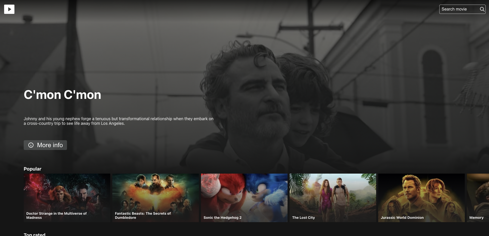

# Netflix Clone app
Simple netflix clone app created with React.js, using https://www.themoviedb.org/ api.



## Table of contents
* [Demo](#demo)
* [General info](#general-info)
* [How to user](#how-to-use)
* [Technologies](#technologies)

## Demo
Here is a working live demo: https://netflix-movies-clone.herokuapp.com/

## General info
This project is a minimalist Netflix clone app. In the application you can search movies, view short information about them and watch their trailers.
</br>
Main purpose of this project was to practice React.js and work with an external API.

## How to use
To clone and run this application, you'll need Git.</br>
From your command line:
```
# Clone this repository
$ git clone https://github.com/tomczer2t/netflix-clone

# Go into the repository
$ cd netflix-clone

# Install dependencies
$ npm install

# Run the app
$ npm start
```

## Technologies
Project is created via Create react app with:
* React: 18.1.0
* Typescript: 4.4.2
* React-router-dom: 6.3.0
* React-icons: 4.3.1
* Axios: 0.27.2
